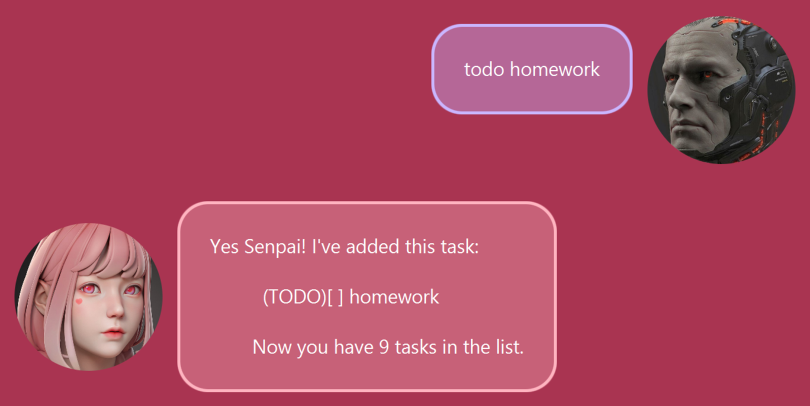
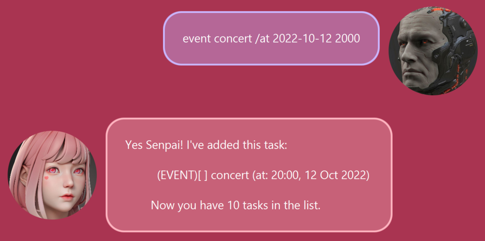
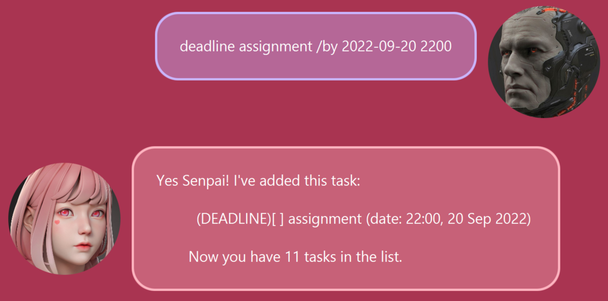
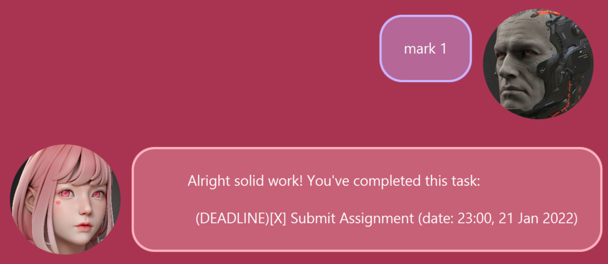
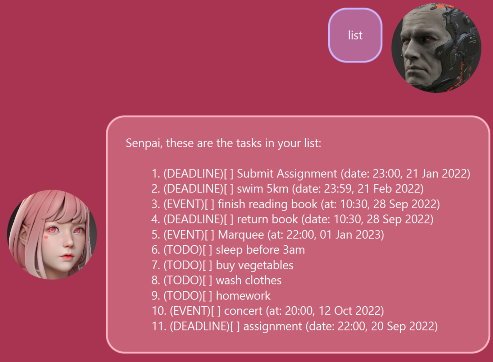
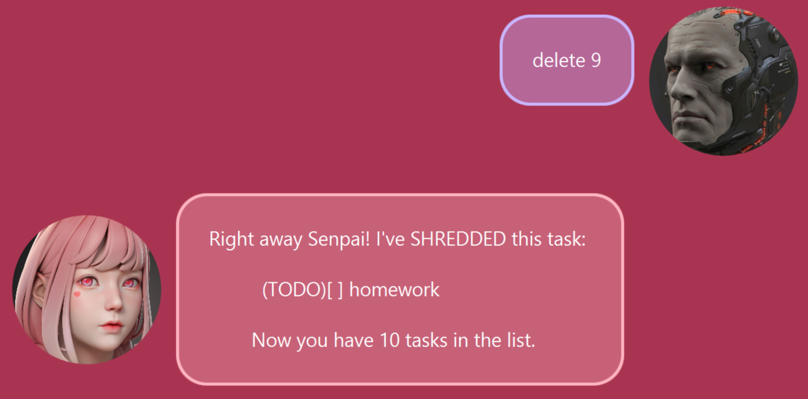
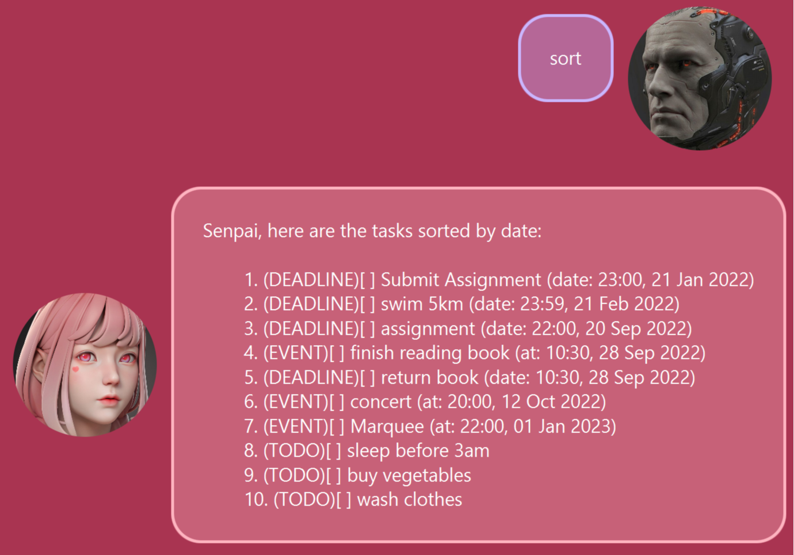
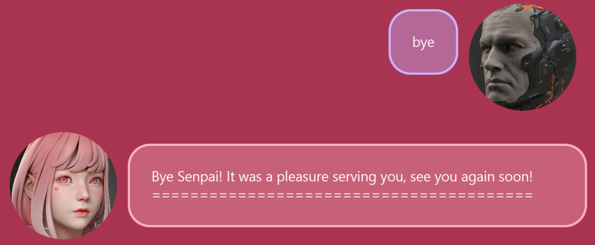

# 🌸 Sakura User Guide 🌸 
**Sakura** is an ALL-IN-ONE task manager application that can help you track and manage all your efficiently 
via a Command Line Interface and aesthetic Graphical User Interfact (GUI).

Why should you use Sakura?
1. Easy to Use
2. Comprises of all the information you need
3. Fast
4. Saves your information so that when you return, your tasks are still present!

So what are you waiting for? Download Sakura [here](https://github.com/Kok-je/ip) and get started on your tasks! („• ◡ •„) ♡

Here's a screenshot of Sakura in action: 

---

## Features

`Todo` - Add your Todo.

`Event` - Add Event.

`Deadline` - Add Deadline.

`Mark` - Mark Task completed.

`Unmark` - Unmark Task as uncompleted

`List` - List all the Tasks that you have so far!

`Delete` - Delete the task that you want to delete

`Find` - Find tasks with similar types of task description

`Bye` - Exits the application

---

###Usage

### 🌸 `Todo` - Adds a Todo task to your list

Format is as such: `todo %s` where `%s` is your task

Example of usage:

`todo homework`

Expected outcome: 

### 🌸 `Event` - Adds a Event task to your list

Format is as such: `event %s /at %d` where `%s` is your task  
and `%d` is the date in the format `YYYY-MM-DD HHMM`

Example of usage:

`event concert /at 2022-10-12 2000`

Expected outcome: 

---

### 🌸 `Deadline` - Adds a Deadline task to your list

Format is as such: `deadline %s /by %d` where `%s` is your task  
and `%d` is the date in the format `YYYY-MM-DD HHMM`

Example of usage:

`deadline assignment /by 2022-09-20 2200`

> **Note**
You will not be allowed to add a task with the same description as it will be treated as duplicate.

Expected outcome: 

---

### 🌸 `Mark` - Marks specified task as completed

Format is as such: `mark %i` where `%i` is your positive integer corresponding to the task

Example of usage:

`mark 1`

Expected outcome: 

---

### 🌸 `Unmark` - Unmarks specified task as completed

Format is as such: `unmark %i` where `%i` is your positive integer corresponding to the task

Example of usage:

`unmark 1`

Expected outcome: 

---

### 🌸 `List` - Lists all the tasks so far

Example of usage:

`list`

Expected outcome: 

---

### 🌸 `Delete` - Deletes specified task as completed

Format is as such: `delete %i` where `%i` is your positive integer corresponding to the task

Example of usage:

`delete 9`

Expected outcome: 

---

### 🌸 `Find` - Finds similar tasks based on description

Format is as such: `find %s` where `%s` is the task description you want to find.   The task description does not need to be matching. As long as there is matching segments, it will be returned.

Example of usage:

`find book`

Expected outcome: 

---

### 🌸 `Sort` - Sorts all tasks based on chronological order

Example of usage:

`sort`

Expected outcome: 

---

### 🌸 `Bye` - Exits the Application

Example of usage:

`bye`

Expected outcome: 

---

